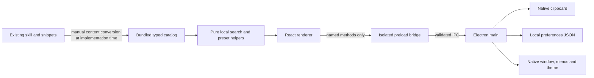

# Part 01: Architecture and shared contracts

Read [Start Here](</Users/blinblon/Claude/Projects/Image Director/03 Docs/Implementation Plan/00-Start-Here.md>) first. The lead owns these contracts and their eventual implementation in `src/shared/`. Workers consume them and propose contract changes to the lead before changing a shared interface.

## 1. Stack and dependency decisions

| Layer | Choice | Implementation instruction |
|---|---|---|
| Desktop runtime | Electron, current stable release when Slice A starts | Resolve and pin once in the lead's lockfile. Keep sandboxing enabled. |
| Build | electron-vite, Vite, TypeScript, React Vite plugin | Use the React TypeScript layout; main/preload/renderer are separate build targets. |
| UI | React and react-dom | Functional components; reducer/context at the application boundary; no routing package. |
| Styling | Modern CSS, CSS Modules, global custom properties | No Tailwind, component framework, CSS-in-JS runtime, or proprietary font bundle. |
| Icons | lucide-react | Import individual icons. Use the fixed icon assignments in Part 03. |
| Motion | CSS transitions and native DOM behavior | No animation dependency. |
| Modal behavior | Native HTML `dialog` | Style the dialog as a sheet. Use `showModal`, native inert background behavior, and explicit focus restoration. |
| Search/content | Plain TypeScript functions and static typed arrays | No Fuse, database, Markdown parser, vector index, or worker thread. |
| Preferences | Node filesystem in Electron main | A single small JSON file, validated manually, with serialized writes. |
| Small logic checks | Vitest as a development dependency | Three focused files at most initially; no component snapshots, DOM test framework, or coverage targets. |

The lead chooses mutually compatible stable versions through the package registry at Slice A, records the actual versions in the manifest/lockfile, and then freezes dependency changes while workers run. Use a supported Node LTS that meets the selected build tools' engines. This is a mechanical version-resolution step, not a stack redesign. The current electron-vite guide lists Node 20.19+ or 22.12+ and Vite 5.0+ as its baseline requirements. [electron-vite getting started](https://electron-vite.org/guide/)

Expected scripts are `dev`, `build`, `preview`, `typecheck`, and `test:logic`. `dev` starts the Electron application through electron-vite; `preview` opens built local renderer assets through Electron. A web dev server alone is not the application. Install/package/signing/distribution scripts are outside this release's acceptance scope.

Fix the build layout in Slice A: package module type is ESM; main outputs `out/main/index.js`; preload outputs a bundled CommonJS `out/preload/index.cjs`; renderer starts at `src/renderer/index.html` and outputs `out/renderer/index.html` with local assets. The package's main entry points to `out/main/index.js`. Runtime code resolves the preload and renderer locations from the built main entry, never from a worker's current shell directory.

## 2. Process boundaries

### Main process owns

Window lifecycle, single-instance behavior, the application menu, preferences IO, native appearance, clipboard writing, local production asset serving, and validation of every incoming IPC call. Main contains no search implementation and does not read skill Markdown at runtime.

### Preload owns

Expose one namespaced object, `window.imageDirector`, using `contextBridge`. Each public method maps to one allowed IPC operation. Strip Electron event objects before delivering allowed UI command values to renderer callbacks. Return an unsubscribe function for command subscriptions.

Bundle preload as one CommonJS `.cjs` artifact. Only Electron's allowed preload APIs remain external; bundle any local runtime helpers. Prefer type-only imports from shared types, so preload does not accidentally pull in filesystem, content, React, or asset modules. Sandboxed preload does not have a full Node environment; bundle its dependencies instead of disabling the sandbox. [electron-vite sandbox limitations](https://electron-vite.org/guide/dev#limitations-of-sandboxing)

### Renderer owns

All presentation, search indexes, derived results, disclosure state, favorites' visible state, copy feedback, and keyboard focus behavior. It may call the named bridge methods. It may not access arbitrary filesystem paths, Node, Electron modules, shell commands, remote websites, or raw IPC channels. This follows Electron's isolated bridge model. [Electron context isolation](https://www.electronjs.org/docs/latest/tutorial/context-isolation)

The app does not interpret a prompt as an instruction to itself. Prompt content is always plain text. It does not execute snippets, evaluate token strings, launch an image tool, or render catalog content as HTML.

## 3. Planned file boundaries

These are implementation destinations, not files created by this plan.

| Area | Planned files | Owner |
|---|---|---|
| Shared contracts | `src/shared/catalog-types.ts`, `desktop-types.ts`, `ui-types.ts` | Lead |
| Root configuration | `package.json`, lockfile, `electron.vite.config.ts`, TypeScript configs, `.gitignore` if needed | Lead |
| Main | `src/main/index.ts`, `window.ts`, `ipc.ts`, `preferences.ts`, `local-protocol.ts`, `menu.ts` | Desktop |
| Preload | `src/preload/index.ts`, `src/preload/index.d.ts` | Desktop |
| Catalog | `src/content/categories.ts`, `families.ts`, `cautions.ts`, `techniques.ts`, `shorthand.ts`, `presets.ts`, `catalog.ts` | Content/engine |
| Pure engine | `src/engine/search.ts`, `presets.ts`, `catalog-integrity.ts` | Content/engine |
| App orchestration | `src/renderer/index.html`, `src/renderer/src/main.tsx`, `app/App.tsx`, `app/app-reducer.ts`, `app/use-desktop.ts`, `app/use-catalog-results.ts`, `app/use-app-commands.ts` | Lead |
| UI | `src/renderer/src/ui/` components and their CSS Modules; `src/renderer/src/styles/` | UI |
| Artwork | `src/renderer/src/assets/` including one bundled photograph, preview SVGs, and credits | UI |
| Minimal checks | `src/engine/engine.test.ts`, `src/engine/catalog-integrity.test.ts`, `src/main/preferences.test.ts` | Owner of tested area |

Keep small related components together until they have separate state or substantial markup. The table gives ownership boundaries, not a requirement to split every helper into a file. `App.tsx` wires callbacks and data; it does not accumulate card, row, and dialog markup.

## 4. Catalog type contract

Use readonly data at the catalog boundary. IDs are stable lowercase kebab-case strings. IDs identify content independently of display text and category order. A typo correction to a title must not lose a favorite.

### Common values

| Type/value | Fields or allowed values | Rules |
|---|---|---|
| `Mode` | `gallery`, `cheatsheet` | Persisted as last selected mode |
| `ThemePreference` | `system`, `light`, `dark` | Default `system` |
| `CategoryId` | `local-edits`, `reference-transfers`, `camera-framing`, `finish-quality`, `motion` | Gallery only |
| `FamilyId` | `routes`, `render`, `camera`, `angles`, `composition`, `lighting`, `looks`, `depth-focus`, `presets`, `reference-patterns` | Fixed Cheatsheet order in Part 02 |
| `Category` | `id`, `label`, `order` | Five records; labels supplied in Part 02 |
| `Family` | `id`, `label`, `order`, `introCautionIds` | Ten records; labels/order supplied in Part 02; notes reference the caution map |
| `SourceRef` | `file`, `heading` | Workspace-relative source filename and actual Markdown heading; used for content maintenance, not routine UI |
| `CautionId` | `preservation`, `reference-roles`, `camera-cues`, `render-size`, `restoration` | Maps to fixed copy in Part 02 |
| `Caution` | `id`, `text` | Five fixed notes from Part 02; displayed by reference |
| `ResolutionExample` | `renderEntryId`, `aspectRatioLabel`, `pixelsText`, optional `note` | Nine source dimension examples: seven 2k mappings and two 4k mappings; reference display only |

### `Technique`

| Field | Type | Required behavior |
|---|---|---|
| `id` | string | Exactly one of the 15 IDs in Part 02 |
| `title` | string | Card/detail title; human wording in Part 02 |
| `categoryId` | CategoryId | Exactly one primary category |
| `summary` | string | One concise sentence; target 60–110 characters; preserve clarity over a hard length cutoff |
| `prompt` | string | Full reusable source prompt, with Markdown presentation syntax removed |
| `shorthandTemplate` | string | The snippet's complete short form, including its literal placeholders |
| `shorthandEntryIds` | readonly string array | Links to relevant canonical Cheatsheet entries or reference patterns |
| `tags` | readonly string array | Three to six plain search terms; no tag-management feature |
| `searchTerms` | readonly string array | A small set of useful source-grounded synonyms, not shown as UI tags |
| `example` | optional string | Preserve a useful source example; absent instead of an empty string |
| `cautionIds` | readonly CautionId array | Contextual source limits; empty allowed |
| `previewId` | string | Same as technique ID; resolves through the UI asset map |
| `order` | integer | Source recipe order, 1–15 |
| `sources` | readonly SourceRef array | At least one exact source heading |

Bracketed placeholders are ordinary text, not a template execution language. No `variables`, user-editable prompt draft, form schema, template evaluator, or automatic prompt concatenation is needed.

### `ShorthandEntry`

| Field | Type | Required behavior |
|---|---|---|
| `id` | string | Stable namespace IDs such as `camera-wide35`, `route-hq`, `render-4k` |
| `kind` | `token` or `pattern` | Presets have their own type below |
| `familyId` | FamilyId | Never `presets` for this type |
| `token` | string | Exact canonical copy value; patterns use a full reference-role or markup template |
| `aliases` | readonly string array | Search compatibility, never duplicate rows |
| `meaning` | string | Short scan-friendly label, target 25–80 characters |
| `direction` | string | Complete production direction from the source |
| `example` | optional string | Source example or a clearly authored, safe usage example |
| `searchTerms` | readonly string array | Additional matching terms where useful |
| `cautionIds` | readonly CautionId array | Applicable fixed content notes |
| `order` | integer | Position within the family, starting at 1 |
| `sources` | readonly SourceRef array | Source provenance |

`direction` must remain usable when copied without the UI around it. Where a conditional limitation is part of the meaning, include it in the direction itself. Merely placing the limitation in a separate note is insufficient.

### `Preset`

| Field | Type | Required behavior |
|---|---|---|
| `id` | string | `preset-commercial`, etc. |
| `kind` | literal `preset` | Discriminates the union used by Cheatsheet |
| `familyId` | literal `presets` | Fixed |
| `token` | string | Exact `preset:...` source token |
| `meaning` | string | Short source-based description |
| `componentEntryIds` | readonly string array | References canonical non-preset token entries in source order |
| `example` | optional string | Source-based one-line use |
| `searchTerms` | readonly string array | Useful matching terms |
| `cautionIds` | readonly CautionId array | Always include `reference-roles`; component notes are also exposed |
| `order` | integer | Source preset order, 1–10 |
| `sources` | readonly SourceRef array | Source heading |

Store component IDs once. Derive the display token list, copyable component line, and expanded production direction through the engine. A preset does not store a second, manually maintained expansion string.

`CheatsheetEntry` is the union of ShorthandEntry and Preset. `Catalog` exports `categories`, `families`, `cautions`, `resolutionExamples`, `techniques`, `entries` (all 104 rows), and maps keyed by ID. Presets appear once inside `entries`; keep their ten source objects in `presets.ts` for authoring. Put the nine dimension examples alongside the render entries and export them through the catalog.

## 5. Pure engine interface

The names below are public module contracts, not proposed application code.

| Export | Inputs | Return | Side effects |
|---|---|---|---|
| `buildSearchIndex` | Catalog | SearchIndex | None; call once at startup |
| `searchCatalog` | SearchIndex, raw query | `SearchResults` | None |
| `selectGalleryResults` | SearchResults, category or `all`, favoritesOnly, favorite ID set | ordered Technique IDs | None |
| `groupCheatsheetResults` | SearchResults, family or `all` | ordered groups of entry IDs and match scores | None |
| `resolvePreset` | preset ID, Catalog | component entries, `componentsText`, `expandedText`, unique caution IDs | None |
| `validateCatalog` | Catalog | list of actionable integrity errors | None; used during logic checks/build validation |

`SearchResults` contains `query`, `isEmptyQuery`, ordered `techniqueMatches`, ordered `entryMatches`, and query-only counts for both modes. Each match contains `id` and numeric `score`. The engine does not return JSX, highlighted HTML, React state, or filesystem data.

Search/filter precedence and exact ranking are specified in Part 02. No worker creates another search/filter implementation inside a component.

## 6. Desktop bridge interface

Expose exactly the following initial surface. Do not export Electron's generic toolkit bridge alongside it.

| Method | Request | Successful response |
|---|---|---|
| `getBootstrap` | none | `preferences`, `platform`, `appVersion`, `persistenceStatus` |
| `copyText` | object containing `text` | `ok: true` |
| `setFavorite` | `techniqueId`, `favorited` boolean | accepted `techniqueId`, `favorited`, and `persistenceStatus` |
| `setThemePreference` | `themePreference` | accepted theme preference and `persistenceStatus` |
| `setLastMode` | `mode` | accepted last mode and `persistenceStatus` |
| `onCommand` | callback receiving a UICommand | unsubscribe function |

`UICommand` permits only `focus-search`, `show-gallery`, and `show-cheatsheet`. `platform` permits `darwin`, `win32`, or `linux`. `Preferences` contains `favoriteTechniqueIds`, `themePreference`, and `lastMode`. `persistenceStatus` is `disk` or `session`.

All request/response values must cross IPC as plain structured-cloneable values. No DOM elements, Electron events, class instances, Sets, Maps, callbacks, file handles, or native paths cross the bridge.

Operations return a discriminated result. Successful results contain `ok: true` and their documented data. Failed results contain `ok: false` and an error with `code` and a short safe `message`. Allowed initial codes: `INVALID_INPUT`, `UNAVAILABLE`, `CLIPBOARD_FAILED`, and `INTERNAL`. Filesystem paths and stack traces stay in development logs.

Disk-write failure is a recoverable session-only preference result, not an IPC failure. A valid preference change remains effective in memory and returns `persistenceStatus: session`. A subsequent successful write persists all accumulated session preferences and returns `disk`.

### Validation

Check both the originating webContents and its top-level sender frame before handling a call. For production, validate the parsed protocol `image-director:`, host `app`, document path `/index.html`, and absence of credentials/port. Compare against those explicit fields; do not rely on a custom URL's `origin` string alone. For development, allow only the exact loopback HTTP origin captured when starting this window. Reject calls from subframes or other windows. Validate request shapes again in main, including enum values, a known technique ID, booleans, and a nonempty clipboard string no larger than 64 KiB in UTF-8.

The catalog supplies a minimal exported technique-ID list that main can import without pulling in renderer code or images. The lead ensures this export exists before the desktop worker integrates favorite validation.

## 7. Clipboard behavior

Renderer selects the immutable payload and invokes `copyText`. Main validates the sender and payload, calls `clipboard.writeText`, and returns success only if the call completes without an exception. Use the ordinary clipboard on every platform; Linux's separate selection clipboard is outside scope. Electron documents clipboard writing in the main process. [Electron clipboard](https://www.electronjs.org/docs/latest/api/clipboard)

Do not read or log the user's clipboard. Do not append attribution, Markdown fences, a title, or a success message to copied content. Do not substitute a web clipboard call when the bridge is absent. A browser-only preview must report that desktop copying is unavailable; it cannot report a successful native copy.

Copy confirmation and repeat-click timing are owned by the UI in Part 03. An unsuccessful write leaves the full prompt selectable for manual copy and exposes Retry on the action that failed.

## 8. Preferences and window persistence

### File and schema

Main stores `preferences.json` under `app.getPath('userData')`. Its schema contains `schemaVersion: 1`, `favoriteTechniqueIds`, `themePreference`, `lastMode`, and `window` with normal bounds and maximized state. Use Electron's application name `Image Director` before resolving userData so the location is stable. No other app state is persisted.

Default values are empty favorites, `system`, `gallery`, and the default window dimensions in section 10. On load, validate each field independently and fill missing/invalid fields from defaults. Deduplicate favorite IDs and drop IDs absent from the bundled catalog. Do not reject all preferences because one field is invalid.

### Write ordering

All preference changes go through a single main-process queue, including window-bound changes. Merge each operation into the current in-memory document when that operation reaches the queue; never save a renderer-supplied whole-document snapshot. Write UTF-8 JSON to a sibling temporary file and rename it into place. The queue prevents simultaneous use of the same temporary filename.

Favorite, theme, and mode mutations enqueue immediately. Bounds updates debounce by 300 ms and save normal bounds, not fullscreen/maximized dimensions. A normal app close flushes the last bounds update and queued writes before exiting; guard the close handler so waiting for a write does not create a close loop.

The renderer never reapplies an entire preference document from a late mutation response. A favorite response changes only that technique's membership in the acknowledged set; it cannot replace the whole set and discard another pending/confirmed favorite. Favorites allow one pending mutation per technique; theme and mode requests carry renderer-local sequence numbers so old acknowledgements cannot reverse a newer visible choice. Favorite icons use the pending optimistic intent, while the Favorites-only list uses main-acknowledged favorite IDs. This lets a pending removal retain its card and focus until the operation settles. On an actual failed IPC result, clear that optimistic intent and retain the previous acknowledged value; a valid session-only result is still an accepted change.

### Read/write failures

If a file is malformed, retain its bytes as `preferences.invalid-<timestamp>.json` before a later clean save. If preserving it fails, keep preferences in memory and avoid overwriting that file during the session. A future schema version is also left intact and used with session defaults; do not silently downgrade it.

If a write fails, keep using the in-memory preferences. Show the persistent session-only indication specified in Part 03, then retry on the next actual preference change. Do not add polling or background retry infrastructure. A read error never prevents the user from browsing/copying the bundled catalog.

## 9. Renderer state and component contracts

### Application state

| State | Lifetime | Owner / rule |
|---|---|---|
| Bootstrap status and preferences | Current window | Lead hook; initialization succeeds before enabling favorite/theme controls |
| `mode` | Current window + last-mode persistence | Reducer; mode shortcuts use the same action as clicking the tabs |
| `query` | Current window, shared across modes | Reducer; maximum 200 characters, enforced consistently by input and engine |
| `galleryCategory` | Current window | Reducer; default `all` |
| `favoritesOnly` | Current window | Reducer; default false; Gallery only |
| `cheatsheetFamily` | Current window | Reducer; default `all` |
| `activeTechniqueId` | Until sheet closes | Reducer; only one sheet can open |
| `featuredTechniqueId` | Current window | Reducer; default `surgical-edit` |
| Favorites and appearance | Current window + disk | Main acknowledgements and optimistic UI intent, through the desktop hook |
| Scroll offsets, open-row IDs | Current window | UI-local per mode; never written to disk |
| Copy feedback and modal focus references | Component lifetime | UI-local; no copied text in persistence |

Changing mode closes an open sheet and preserves query, each mode's filters, and each mode's last scroll position. Changing query resets both modes' scroll positions to the top and closes detail. Changing a mode-specific filter resets only that mode's scroll position and closes detail if relevant. Toggling a favorite does not reset scroll.

Derived lists/counts belong in selectors, not reducer state. Query-only counts are computed before mode-specific filters. Global search edits keep input focus. A native menu command to focus search closes the sheet first, then focuses and selects the existing query.

Keep both mode panels mounted. Apply the native hidden attribute to the inactive panel, with styles that preserve its display-none behavior; it must have no active scroll surface or focusable descendants while hidden. Each panel retains its disclosure state. Capture its scroll offset before hiding and restore that offset after showing it. Query changes reset both saved offsets; mode-specific filter changes reset only the affected offset.

### Public UI boundary

| Component | Data props | Callbacks / responsibilities |
|---|---|---|
| `AppShell` | platform, mode, query, query counts, theme, persistence status | mode change, query change, appearance change; renders rail/header/content slots |
| `GalleryView` | ordered Technique records, category list, active category, favoritesOnly, favorite IDs, featured technique | category/filter changes, open technique, toggle favorite, copy request, select feature |
| `TechniqueCard` | technique, favorite/pending state | open, favorite, copy prompt; never reads main or engine directly |
| `TechniqueSheet` | technique or null, favorite state, resolved linked entries | close, favorite, copy request; owns native dialog and focus restoration |
| `CheatsheetView` | grouped entries, active family, catalog resolver result for presets | family change, copy request; owns inline disclosure IDs and family navigation |
| `CopyButton` | exact payload, action label, success label, copy callback | local idle/pending/success/error state; no payload derivation |

The lead passes the real async copy callback. UI components cannot import Electron or create a second persistence service. `CopyButton` returns feedback for the exact payload used in that click even if adjacent state changes before completion.

## 10. Native shell

Create one resizable window with a 1280 × 900 default content viewport and a 640 × 600 minimum content viewport. Use `useContentSize` for the initial width/height. Native minimum-size APIs describe the outer window: after creation, measure the difference between window bounds and content bounds, add that frame delta to the 640 × 600 content minimum, and set the resulting outer minimum. Use measured content dimensions when checking the responsive scenes. Keep native fullscreen, maximize, minimize, close, window shadow, and native corner treatment. [Electron window options](https://www.electronjs.org/docs/latest/api/structures/base-window-options)

Set both application identity and the renderer document title to “Image Director”. Remove the starter's logos, welcome screen, framework version panels, and placeholder help links from the visible app.

On macOS use `titleBarStyle: hiddenInset`, ordinary native traffic lights, and a 44 px renderer titlebar reserve. The reserved strip is draggable; all buttons, fields, and text content are outside the drag region. Reserve at least the leftmost 90 px for traffic lights. Do not replace traffic lights or make them hover-only. Electron supports hiddenInset and native traffic-light positioning. [Electron custom title bars](https://www.electronjs.org/docs/latest/tutorial/custom-title-bar)

On Windows/Linux keep the normal native frame and titlebar. The renderer's custom titlebar reserve is 0 px. The UI begins below the OS titlebar. This avoids separate custom window-control implementations and preserves the same content-space sizing rules.

macOS is the initial acceptance host for this project. Implement the stated Windows/Linux fallbacks, but describe them as unverified until the app is actually run on those systems. The first useful macOS app does not wait on an unavailable second operating system.

Set an opaque background color from the resolved theme before showing the window. Do not enable a transparent BrowserWindow, desktop vibrancy, or a backdrop-dependent window frame. Limited translucency is CSS inside the app. Load saved appearance before window creation; set `nativeTheme.themeSource` to the selected value and follow OS changes in system mode. The renderer follows `prefers-color-scheme`, which reflects Electron's theme override. [Electron nativeTheme](https://www.electronjs.org/docs/latest/api/native-theme)

Restore saved bounds only when a rectangle at least 128 × 80 px remains on a current display. Clamp size/position to that display's work area. If the work area cannot fit the normal minimum, temporarily cap the outer minimum to the available work area and let the compact UI scroll vertically. Center default bounds on the primary display if no usable intersection exists. Do not reopen a lost offscreen window.

Use a single-instance lock; a second launch focuses the existing window. On macOS closing the last window leaves the app active, and activation reopens it. On Windows/Linux closing the last window quits. Register IPC handlers once per application lifecycle, not every time a window is recreated.

### Native menu and keyboard delivery

The menu includes ordinary app/Edit/Window roles plus View actions for Search, Gallery, and Cheatsheet. Assign `CommandOrControl+K`, `CommandOrControl+1`, and `CommandOrControl+2` to those three native menu items. Send one sanitized UICommand to the focused app window. Do not also register the same shortcuts through a global keydown listener or Electron globalShortcut.

Native Edit roles retain select-all/copy/paste behavior in the search field and selected prompt text. `Esc`, tab navigation, segmented-control arrows, and row disclosure are renderer behaviors from Part 03. Developer tools are available through normal development controls, not a prominent product button.

## 11. Local loading and security

Set `contextIsolation: true`, `sandbox: true`, `nodeIntegration: false`, `webSecurity: true`, and `webviewTag: false`. Deny new windows, permission requests, and in-app navigation to other pages. Restrict IPC to the app's top-level frame. These decisions follow Electron's security recommendations. [Electron security](https://www.electronjs.org/docs/latest/tutorial/security)

In development, load only the electron-vite loopback origin supplied to the app by its own development launcher. Restrict the dev server to loopback. Permit its exact local HTTP/WebSocket origins for HMR in development only.

For built local execution, register the standard, secure scheme `image-director` before app readiness and serve `image-director://app/index.html` through a protocol handler. Set standard/secure privileges; do not bypass CSP or enable service workers. Serve only GET/HEAD requests for the built renderer root. No arbitrary file picker or file-serving IPC exists. [Electron protocol API](https://www.electronjs.org/docs/latest/api/protocol)

The protocol handler validates host `app`, rejects malformed encoding and path separators hidden in encoded segments, resolves the URL path under the built renderer directory, and rejects a relative result that escapes that root. `/` resolves to `index.html`; unknown paths return 404. Serve correct content types and local bytes. Renderer asset imports must resolve under this origin in `preview`, without a running Vite server.

Production CSP permits local scripts, local styles, and local images only; `connect-src`, frames, objects, form submission, and base-URL rewriting are disabled. Use extracted CSS and classes/data attributes rather than requiring unsafe inline scripts or remote assets. The developer's static source URLs remain in plan/asset credits, not runtime fetches.

## 12. Small failure surfaces

| Failure | Visible result | Recovery |
|---|---|---|
| Bridge absent | Static catalog can still render in a development browser, but native actions say “Open the desktop app to use this action.” | Lead verifies in Electron; no pretend clipboard or persistent success |
| Bootstrap preference error | Catalog remains usable with defaults; session-only indicator | User can keep working; future valid save restores disk status |
| Clipboard exception | “Couldn't copy” at that action, Retry, selectable text remains | Retry the same captured payload |
| Invalid catalog | Development/build validation fails with item ID and source heading | Content worker corrects source conversion; don't silently drop content |
| UI render exception | One app-level error boundary with a concise restart instruction and development error detail outside normal UI | Lead fixes the error; no nested error-boundary framework |

Desktop completion is the live native behavior described in Part 04, not the mere existence of these files.
