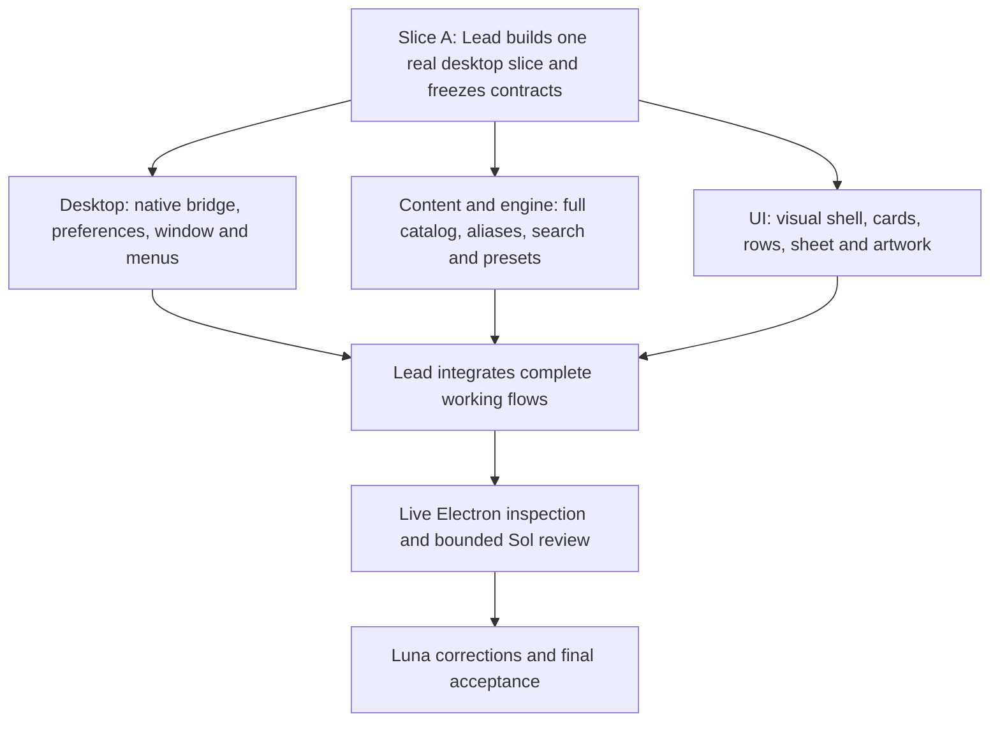

# Part 04: Execution plan, worker assignments, and acceptance

This part is for the subsequent authorized implementation run. It does not authorize or start implementation during the planning task.

Read [Start Here](</Users/blinblon/Claude/Projects/Image Director/03 Docs/Implementation Plan/00-Start-Here.md>) first. The lead owns integration and the final conclusion. Workers deliver verified inputs in their assigned files. The existing `image-director/` skill is source material and remains unchanged.

## 1. Execution rules

Implement one real vertical slice before broad parallel work. After that slice fixes the shared contracts, use three bounded Luna workers: Desktop, Content/engine, and UI. The lead integrates while those workers progress. If fewer execution slots are available, keep the same ownership and run the assignments sequentially; do not redesign the plan around capacity.

Only the lead changes root dependencies, the lockfile, shared types, and renderer orchestration. Workers may read across boundaries but edit their assigned paths. Every worker is sharing the codebase: preserve others' edits and adapt to the current integration state. Do not reset, clean, stash, broadly format, or regenerate sibling areas.

Use the current tool-supported Luna model for implementation at the user's default effort. Sol participates only at the bounded checkpoints below. This plan is sufficient authority for normal implementation decisions; no return to Astra is required. Follow the user's existing os-build/Sol-Luna routing for the implementation session, using the in-app browser for any ChatGPT Web review. Do not automate Zen.

Architecture and source decisions are already settled. Escalate to the lead only when a shared contract cannot satisfy an existing acceptance criterion, a platform restriction contradicts the plan, or a requested action is outside scope. Continue other owned work while the lead resolves the issue. Missing bookkeeping is not a product blocker.

## 2. Dependency graph

Maximum useful parallelism is the lead plus three workers. Do not launch separate agents for every component, token family, or diagram. The UI and content work already have clear internal sequences. Only the lead runs and drives the shared Electron instance for integrated acceptance; a worker requests a turn with that instance instead of opening a competing app.

## 3. Slice A: One real desktop slice and shared contracts

Owner: lead. Dependencies: none. Goal: a real source recipe appears in Electron and copies successfully before parallel work begins.

### Actions

1. Inspect the current folder for new work since this plan. Read any AGENTS.md/MAP.md that now exists. Preserve the supplied skill and these plan files. Establish only the application files required by the chosen stack; avoid a separate project-setup/documentation phase.
2. Resolve compatible stable dependencies and create the main/preload/renderer build configuration. Write the Part 01 shared types and the minimal real preload interface, with sandbox/context isolation enabled.
3. Create initial catalog exports containing Surgical edit and a few real related entries, including hq and a camera entry. Import the source prompt exactly. Create the renderer entry and a small visible shell that displays the real prompt and invokes the real native clipboard method.
4. Start the actual Electron application, activate Copy prompt, and paste into a disposable local text buffer to confirm the complete source text arrived. Fix the build/preload boundary if it fails; do not mask it with a browser clipboard fallback.
5. Freeze the exported contract names and hand ownership of main/preload, content/engine, and UI paths to the assigned workers. Supply the current entry points and pending integration callbacks in each assignment.

### Shared contracts to settle before handoff

The lead writes the catalog types, bridge result union, UI command enum, and component props specified in Part 01. `CopyButton` receives a payload and a promise-returning copy callback. Gallery components receive real technique records and explicit callbacks. Cheatsheet receives grouped entry records plus resolved preset details keyed by ID. UI does not call the engine or IPC directly.

Define a `ResolvedPreset` data shape with `components`, `componentsText`, `expandedText`, and `cautionIds`. Define a Cheatsheet group shape containing `familyId`, `label`, and ordered entry records. Keep maps/sets inside the renderer; IPC uses plain values only.

Supply family introductions, caution text, and the nine resolution examples through the catalog props. UI components must not keep a second copy of that source-derived content. The renderer shell may own ordinary interface labels such as Copy, Search, and Appearance.

The initial seed is visibly incomplete and must not hardcode final result counts. The UI derives counts from supplied data. After handoff, the Content/engine worker owns replacement of the seed with the complete source catalog. The lead does not edit those source arrays concurrently.

### Completion

The Electron window opens, the real seed prompt is readable, native copy works, contracts compile together, and each worker has a bounded file assignment. There is no requirement for polished artwork or the complete catalog at this slice.

## 4. Slice B: Three owned workstreams

### B1. Desktop worker

**Own:** `src/main/`, `src/preload/`, and the preference-logic check. **Read:** Part 01 sections 2, 6–8, and 10–12; the shared types; the minimal seed implementation. **Do not edit:** shared types, content arrays, renderer UI, root dependencies/lockfile.

| Step | Implement | Finish condition |
|---|---|---|
| B1.1 | Finish the named preload bridge and IPC validation | Only the Part 01 bridge methods are exposed; sender/input validation exists; invalid input has safe errors |
| B1.2 | Preferences load/merge/write queue and theme application | Favorites/theme/mode persist; one mutation cannot overwrite another; malformed input yields validated defaults/session handling |
| B1.3 | Native window sizing, bounds restore, lifecycle, single-instance lock | Correct macOS lifecycle, safe visible reopen, Windows/Linux frame fallback, one window at a time |
| B1.4 | Native menu commands and production local protocol | Cmd/Ctrl+K/1/2 delivers one UI command; `preview` serves bundled local assets with Vite stopped |
| B1.5 | Focused preference checks and live native handoff | Preference merge/default logic checked; clipboard/theme/relaunch demonstrated through the lead's actual app |

Preference tests cover independent-field validation, deduplication/removal of invalid favorite IDs, and sequential independent mutations preserving previous changes. If the write queue has nontrivial behavior, include one narrow temporary-directory check for serialized writes. Do not construct a fake Electron integration framework.

Ask the lead for the final known-technique-ID export when integrating favorite validation. Do not copy the list into another unrelated file or import renderer code into main.

Desktop work is complete only when it runs with the real renderer bridge. A passing TypeScript build does not prove native copy or a packaged-origin preview.

### B2. Content / engine worker

**Own:** `src/content/`, `src/engine/`, and their focused logic checks. **Read:** Part 02 in full, Part 01 catalog and engine contracts, the four existing skill files as needed. **Do not edit:** the original skill, main/preload, UI, shared types, root configuration.

| Step | Implement | Finish condition |
|---|---|---|
| B2.1 | Five categories and the 15 technique records | Manifest IDs/order match; all full prompts and shorthand templates trace to source |
| B2.2 | 104 Cheatsheet entries, including the source aliases/patterns | Exact family membership is complete; aliases do not add duplicate rows |
| B2.3 | Preset resolver and source cautions | Ten presets resolve to canonical components; editorial/fashion camera corrections are applied |
| B2.4 | Search index, ranking, and mode-specific selectors | Part 02 query cases work; filters intersect correctly without leaking across modes |
| B2.5 | Focused checks and integration exports | Integrity errors are empty; lead can import the complete catalog and engine without UI/native dependencies |

Do not postpone most content until after UI polish. Full source content, especially the long restoration recipe and reference patterns, is needed to expose actual layout problems. Deliver the complete arrays as early as possible, then finish ranking and checks.

The lead may consume stable exports while this worker continues improving internal implementation. Export-name changes go through the lead; source content changes stay inside the worker's files.

### B3. UI worker

**Own:** `src/renderer/src/ui/`, `src/renderer/src/styles/`, and `src/renderer/src/assets/`. **Read:** Part 03 in full, Part 01 component contracts, Part 02 manifest/copy/caution sections. **Do not edit:** renderer orchestration hooks, engine, native bridge, shared types, root configuration.

| Step | Implement | Finish condition |
|---|---|---|
| B3.1 | Theme tokens, native-safe frame, responsive mode control and search | Correct light/dark surface system; wide rail and compact horizontal control; real callbacks fire |
| B3.2 | Gallery cards, category/favorite controls, source-linked feature | Responsive 3/2/1 grid; separate Open/Favorite/Copy controls; source content drives all labels |
| B3.3 | Native dialog sheet and shared CopyButton | Full prompt visible immediately; local copy states, focus restoration, and compact sheet work |
| B3.4 | Cheatsheet groups, family navigation, row/preset disclosure | Dense rows remain readable; every defined copy action uses its supplied exact payload |
| B3.5 | Photograph, all 15 diagrams, Appearance, empty states, motion | Assets match every preview ID; reference style is visible; reduced-motion and long-content layouts work |

Use callback props and actual supplied content. If engine data is temporarily unavailable, work against the lead's real seed objects in a local isolated component view, but do not commit fake final counts, invented prompts, random photo URLs, or a fake successful clipboard path. A browser preview can aid CSS work; only Electron verifies the native flows.

The UI worker may request a time window to drive the lead-owned Electron instance. During that window, other workers continue code/content work. Return the instance with a concise list of concrete visual defects fixed or remaining; do not create a separate UI approval bureaucracy.

## 5. Slice C: Lead integration

Owner: lead. Dependencies: stable contracts from Slice A and usable outputs from B1/B2/B3. Integration can begin incrementally; final completion requires all three workstreams.

### Actions

1. Wire catalog/index initialization and pure selectors into the reducer-owned mode/query/filter state. Preserve query across modes and keep query-only counts separate from displayed counts.
2. Wire desktop bootstrap and preference mutations. Favorite icons read optimistic intent; the Favorites-only filter uses main-acknowledged favorites so a pending removal does not detach its focused card. Apply mutation responses only to their affected fields.
3. Wire each UI action to its exact source payload. Open/close the sheet without changing the grid. Implement per-mode scroll restoration and explicit focus destinations for dismiss/search/mode commands.
4. Mount the complete Gallery and Cheatsheet, verify all manifest previews resolve, and remove seed-only shortcuts, mock success paths, and placeholder counts.
5. Run the targeted logic/type checks, start the app, and walk the practical flows below. Fix integration failures in the owning files, coordinating with active workers before edits.

### Practical integration walkthrough

| Flow | Expected result |
|---|---|
| Open Gallery, scroll, open a card, close it | Same grid width/filter/query/scroll; focus returns to the opener |
| Search an alias, switch mode, clear query | Alias resolves; query persists across switch; clearing query does not reset unrelated mode filters |
| Favorite a technique, filter Favorites, reopen the app | Correct favorite appears after restart; a failed disk save was labelled session-only |
| Copy a long prompt, a pattern, a token, and preset components | Each pasted value matches its distinct source/engine payload without truncation or added formatting |
| Open Cheatsheet preset, resize, use keyboard | Components remain accessible; controls wrap; keyboard focus remains usable |

Keep both mode panels mounted, using the native hidden attribute on the inactive one as specified in Part 01. Hidden content has no active scroll surface and cannot receive keyboard focus. Capture scroll before hiding and restore it after showing; preserve each panel's local row disclosures. Do not add a router or a second state store for this behavior.

### Completion

All production user paths run through the real desktop bridge and complete catalog. No worker-specific preview or stub is necessary to demonstrate a required interaction.

## 6. Slice D: Live inspection and bounded Sol review

Owner: lead, with Sol as reviewer and Luna correcting findings. Dependencies: Slice C. The review is about a working app, not presentation of a plan as progress.

### Sol checkpoint 1: Contract drift, once after Slice A or early integration

Provide the shared types, the process/bridge design, and the actual relevant files. Request a short review of cross-process boundary mistakes, shared-state duplication, and whether the chosen contracts can deliver this plan. Sol returns specific changes with file/contract names. It does not expand scope, reopen settled visual direction, or design a new architecture.

The lead continues independent work while this review runs. Only changes that affect a shared contract block its dependent worker. Routine UI spacing, labels, content conversion, and ordinary bugs remain Luna decisions.

### Sol checkpoint 2: Integrated app, one batched review

Provide these plans by path, a compact description of completed flows, and screenshots from the actual Electron window. Use the in-app browser for a ChatGPT Web Sol review when available under os-build. Do not claim Sol participated if the connection/model is unavailable; perform a bounded lead review and identify that substitution in the implementation result.

Request review of three areas: reference fidelity and usable density, source semantics/copy meaning, and actual interaction defects. Ask for only actionable findings, each with its location, observed behavior, required correction, and whether it blocks acceptance. Do not send a repository dump or transcript.

### Visual inspection scenes

| Actual Electron scene | Inspect |
|---|---|
| 1280 × 900, light, default Gallery | Pale/teal reference style, photo feature, three cards, title hierarchy, clear copy/favorite affordances |
| 1024 × 800, dark, Cheatsheet with an expanded preset | Dark contrast, readable rows, component directions, working family/search layout; briefly switch Gallery to verify two columns |
| 640 × 600, light, restoration detail open | Full-width sheet, long readable prompt, fixed reachable Copy prompt, keyboard dismissal; close to confirm one-column Gallery |

Drive each scene; screenshots alone do not establish interaction. Open the saved captures and confirm they show the actual app and intended state before reviewing them. Do not label a browser rendering as Electron evidence.

Make one combined visual inspection pass, batch the material fixes, then make one confirmation pass. If functional defects remain, fix those directly and verify the affected flow. Do not spend unlimited rounds hunting subjective micro-polish after the reference style and required interactions hold.

### Completion

Concrete review findings affecting functionality, content meaning, or visible layout are fixed and checked. Any remaining subjective taste judgment is explicitly separate from a functional defect. Another Astra planning pass is unnecessary.

## 7. Slice E: Final native acceptance

Owner: lead. Dependencies: integrated app and material corrections. This is the single final acceptance gate; do not add broad infrastructure around it.

1. **Start and stay local:** actual Electron starts in development and built preview, with the Vite server stopped for preview; the bundled app remains usable offline and has no obvious runtime/preload errors.
2. **Browse complete source content:** all 15 techniques and 104 Cheatsheet entries are reachable; full prompts, preset components, aliases, and source conditions are correct.
3. **Find and copy:** shared search and scoped filters work; one full prompt, a long restoration prompt, a shorthand template, a canonical token, a reference pattern, and a preset component line paste with the exact defined payloads; confirmation follows success.
4. **Use it as a desktop utility:** favorite/theme/last mode survive a normal restart; Cmd/Ctrl+K/1/2, Esc, native text copy, focus restoration, and native window controls work; a session-only save is described truthfully if encountered.
5. **Inspect the real UI:** the three scenes above have been driven and visually checked; Gallery transforms 3/2/1, both themes are readable, reduced motion removes movement, and no important text or control needs horizontal scrolling.

Run only the targeted logic checks and a type/build check appropriate to the changed files. No broad component suites, screenshot snapshots, coverage percentage, benchmark suite, installer, signing, updater, deployment, or CI/CD work is required to pass this gate.

## 8. Ready-to-use assignment briefs

These are dispatch text for the subsequent implementation lead. Replace only the current progress sentence and any actual path that changed. Do not paste the entire plan into every worker's context.

### Lead brief

Implement Image Director from `/Users/blinblon/Claude/Projects/Image Director/03 Docs/Implementation Plan/00-Start-Here.md`. Complete Slice A before assigning the three owned workstreams in Part 04. You own shared contracts, root configuration, renderer orchestration, integration, and final native acceptance. Read current project instructions if they now exist. Preserve the original `image-director/` skill. You are working alongside other agents; keep edits inside your ownership and coordinate before changing an active worker's file. Use the real Electron app for acceptance and continue until the five-item gate is met. No additional Astra interpretation is required.

### Desktop brief

Implement Slice B1 in Part 04. Read Start Here and Part 01. You own `src/main/`, `src/preload/`, and the focused preference checks. You are not alone in the codebase: preserve other workers' changes, and do not edit shared contracts, root dependencies, content, or renderer UI. Consume the lead's bridge types and known-technique-ID export. Deliver native clipboard, safe preferences, window/menu/theme behavior, and local production loading. Do not disable sandboxing or expose generic IPC. Coordinate use of the lead's Electron instance. Return changed paths, demonstrated native behavior, and concrete blockers, then stop at your ownership boundary.

### Content / engine brief

Implement Slice B2 in Part 04. Read Start Here, Part 01 data/engine contracts, and Part 02. You own `src/content/`, `src/engine/`, and their focused checks. You are not alone in the codebase: preserve other workers' changes and do not edit shared types, renderer, native code, configuration, or the original skill. Convert all 15 source recipes and all 104 reference entries; apply only the documented hq/camera alias resolutions. Build deterministic search/filter selectors and preset expansion with the exact public exports. Deliver complete content early so UI work uses real long text. Return changed paths, catalog coverage, passed focused checks, and any contract issue requiring the lead.

### UI brief

Implement Slice B3 in Part 04. Read Start Here, Part 01 UI contracts, Part 03, and Part 02's manifest/copy rules. You own `src/renderer/src/ui/`, `styles/`, and `assets/`. You are not alone in the codebase: preserve other workers' changes; do not edit app orchestration, shared contracts, native code, content/engine, or root configuration. Reproduce the supplied reference's pale/teal visual language with the specified photograph, rail/capsule, curves, cards, and native dialog sheet. Implement real callback-driven states, complete responsive layouts, and all 15 preview diagrams. Copy payloads are supplied by the lead/engine. Coordinate actual Electron inspection with the lead; browser-only results cannot prove native behavior. Return changed paths and concrete visual/interaction issues needing integration.

### Sol review brief

Review the current Image Director implementation against its five-part plan, beginning at Start Here. The lead will specify whether this is the contract or integrated-UI checkpoint and provide only the relevant files/screenshots. Preserve the chosen product, source semantics, and screenshot-derived direction. Find concrete contract breaks, content/copy errors, focus/state defects, and visible usability/fidelity defects. Return actionable findings with exact locations and corrections, and distinguish blockers from optional taste refinements. Do not add features, reopen stack selection, require broad test infrastructure, or route ordinary implementation back to Astra.

## 9. Implementation completion report

Report the working result in plain language, give the command or existing app entry that opens it, and identify the actual native checks performed. Link at most the most useful screenshots if available. State a material remaining limitation only if one exists. Do not substitute file counts, receipt hashes, or test totals for the user's ability to browse, understand, and copy prompts.

The next concrete implementation action is Slice A.
