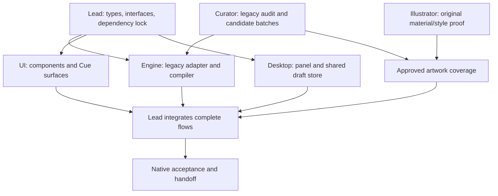

# Lead — execution and acceptance

## Paste-ready dispatch prompt

> Execute the Teleprompter plan in `/Users/blinblon/Claude/Projects/Teleprompter`. Read AGENTS.md and MAP.md, then `03 Docs/Teleprompter Plan/00-Start-Here.md`, the audit, shared contracts, and this mission. The user has chosen the product/architecture/UX decisions in this pack; implement them without restarting broad discovery. Use os-build and the configured Sol-Luna workflow for substantive implementation/review, reporting Sol participation only when it actually occurs. You own root configuration and metadata, `src/shared/`, renderer app/state wiring, cross-worker integration, acceptance, and project state. Delegate the bounded engine, UI, desktop, illustration, and curator missions with their explicit path ownership. Workers are not alone in the codebase; preserve parallel edits. Keep original source and historical plans intact. Deliver the working native app and evidence for each required flow. No runtime LLM, auto-paste, installers, spending beyond already authorized generation access, or publication is included.

## Sequence and dependencies



The curator can audit sources and propose batches before engine validation exists. The illustrator can establish the original material family before catalog expansion. UI can build against the published props/fixture snapshots while the engine and desktop implementations progress. Do not wait for a fully expanded long-term library before building Cue.

## Ownership

| Owner | Write paths | Read-only dependencies |
|---|---|---|
| Lead | Root manifests/config/docs; `src/shared/`; `src/renderer/src/app/`; renderer entry files; integration report | All worker outputs |
| Engine | `src/content/`; `src/engine/`; their tests | Shared contracts; accepted curator batch |
| UI | `src/renderer/src/ui/`; `src/renderer/src/styles/` | Engine API, bridge snapshot, approved asset manifest |
| Desktop | `src/main/`; `src/preload/`; their tests | Shared contracts, pure engine |
| Illustration | `src/renderer/src/assets/teleprompter/`; execution Artwork folder | Supplied references; accepted AssetRequests |
| Curator | `03 Docs/Library Curation/` | Original library, shared schema, accepted content |

Each worker owns its named handoff file under `03 Docs/Teleprompter Execution/`. Only the lead edits root MAP/AGENTS and accepts/imports a batch through the engine owner. Workers send dependency-change requests instead of racing over package files, shared types, or app orchestration. Use the runtime's available capacity; a plan with six roles does not require six simultaneous agents or duplicate implementations.

## Slice 1 — publish concrete interfaces

Update root routing to distinguish the old implemented app from the new plan. Capture current dirty boundaries and preserve them. Materialize the shared library/draft types and runtime validators from the contract. Define result/error types and touched-field paths before worker dispatch. A valid build with stubs that return explicit unavailable results is sufficient at this point; do not pretend stubs are integrated behavior.

Publish these renderer boundaries:

```ts
interface CueSurfaceProps {
  surface: 'main' | 'spotlight';
  snapshot: CueSnapshot;
  library: LibraryView;
  dispatch: (command: CueCommand) => Promise<CommandResult>;
  copy: (format: 'expanded' | 'shorthand') => Promise<CopyResult>;
  requestSize?: (size: 'compact' | 'expanded') => void;
  dismiss?: () => void;
}
// CueSnapshot wraps both drafts, per-field revisions, active mode,
// snapshot sequence, shortcut state, and persistence status.
// LibraryView is a derived query/record projection from the engine.
```

Materialize the referenced types; the comments are not permission to maintain divergent interfaces. Main and spotlight render the same `CueSurface` with density/size differences. The lead's hook handles buffering, command queues, subscriptions, and conflict resolution. The UI never calls raw IPC or writes JSON files.

Install the chosen UI dependencies once, inspect current registry requirements, and lock versions. Configure renderer-only Tailwind v4 and the import aliases needed by vendored SmoothUI. Replace the old global CSS through the UI lane rather than layering a second theme over it. Remove Lucide only after all consumed registry icons have been mapped to Phosphor and no imports remain. Keep the current working Electron/React toolchain unless an actual incompatibility requires a narrowly documented change.

## Slice 2 — a real Create path

Wire legacy content → valid choices → structured draft → expanded preview → main-process compile/copy. Implement dark Cue as the default launch view. Complete WHAT, all three parameter groups, IMPORTANT, AVOID, and OUTPUT. Prove partial/blank templates and a deconstructed preset with manual overrides. This slice ends on a working flow in the actual app, not a gallery of disconnected components.

The UI and desktop workers then connect the same Cue surface to the cursor popup. Copy must use the acknowledged revision, including the last character typed. Close and reopen it without losing values. Use correct native evidence before claiming spotlight completion.

## Slice 3 — Edit and library integration

Connect every baseline edit family and its slots. Exercise multiple operations, reference roles, lock subtraction, blank placeholders, and conflicts. Connect Library Apply actions and Tokens search/inspection to Cue. Migrate original content and favorites without deleting their original meaning. Import only accepted curator batches with a validated base version; out-of-date batches are rebased by the curator, not blindly overlaid.

Integrate approved identity, group/lens objects, practical comparisons, and preset images from the asset manifest. Text-only states remain for entries outside the initial image coverage; remove the old unrelated photo and instructional SVGs from active UI. Keep historical files if they are source material. A missing asset must never become a broken-image icon or a mislabeled fallback photo.

## Slice 4 — native interaction and visual acceptance

| Flow | Required observation |
|---|---|
| Cold launch | Teleprompter identity, dark surfaces without a flash, Cue default, saved drafts/favorites intact |
| Create from blank | Every template field reachable; compatible multi-select; missing fields remain editable placeholders after manual paste |
| Preset customization | One click fills defaults; exact atoms visible; a manual override survives a new preset; reset/undo are scoped |
| Combined Edit | Camera/background changes remove those locks; reference roles and missing slots compile honestly |
| Shortcut popup | Opens by cursor over another app, stays within work area, accepts input, grows for picker, copies current draft, hides and restores normal keyboard use |
| Two surfaces | No last-keystroke loss; disjoint changes merge; stale same-field text is recoverable; no duplicate events |
| Overlay behavior | Click-away; drag release; nested Escape; ⌘K destination focus; destroyed opener fallback |
| Navigation/layout | Icon dock contains all controls at 720×560 and normal size; long labels/chips wrap; each view retains scroll; no horizontal overflow |
| Motion | Visible smooth tab/picker/slot/copy transitions, bounded magnetism, crisp text, no animation while hidden; reduced-motion fallback works |
| Failure states | Copy/IPC failure, disk write failure, bad legacy file, shortcut conflict, missing record/image all communicate their actual state |
| Offline behavior | Built local app loads all accepted content/assets and copies while network is unavailable |

Run affected compiler/store tests, typecheck, and a production build once the integrated dependency cone is ready. Repeat only after relevant changes or an unresolved failure. Drive the real Electron app; browser previews can inform layout but cannot prove native shortcuts, clipboard, focus, or migration. Preserve clipboard contents or use an audit-owned text destination where practical; verify actual text, not merely the checkmark animation.

Capture stills at the tested main/popup dimensions and a short native recording showing motion and click-away. Include a reduced-motion pass. Record exactly which displays/Spaces were available. Synthetic placement tests cover unobserved geometries; they do not become a claim of physical multi-monitor testing.

Use a short targeted integration review of domain correctness, renderer races, and desktop sender validation. Fix demonstrated issues within the affected scope. A static detector result is supplementary; the current audit returned no findings while the native UI still failed basic interaction checks.

## Slice 5 — finish the handoff

Update MAP with the implemented state, accepted content version, evidence paths, exact remaining limitations, and next task. Preserve original sources and old plans as history. Write `03 Docs/Teleprompter Execution/Acceptance.md` with one row per flow above, tested environment, result, and evidence location. Link each worker's compact handoff; do not paste their conversations.

The v2 milestone is complete when Cue Create/Edit, main/popup synchronization, native copy, dark redesign, initial artwork coverage, and baseline catalog mapping pass the required flows. Long-term curation continues through its own batch queue. If practical artwork is blocked by exact-model access, report that as an incomplete artwork criterion while completing independent code work; do not label the entire redesign fully accepted.

## Decisions to log when evidence arrives

| Topic | Current decision | Evidence still needed |
|---|---|---|
| Global shortcut | Cmd/Ctrl+Shift+Space with user-editable fallback | Registration on the user's machine |
| Panel focus/Spaces | Reusable native macOS panel | Focus returns to prior app; behavior in available full-screen Spaces |
| GPT Image 2.5 route | Flare for practical examples, per user override | Execution tool can select/report required model and has authorized access |
| Corpus changes | Validated candidate batches only | Curator's semantic audit and accepted migration mappings |
| Native platform coverage | macOS acceptance first | Separate Windows/Linux sessions before claiming support |

These are execution checks, not reasons to reopen settled architecture or stop independent workers. The lead logs material changes once in the relevant contract and points workers to that decision.
