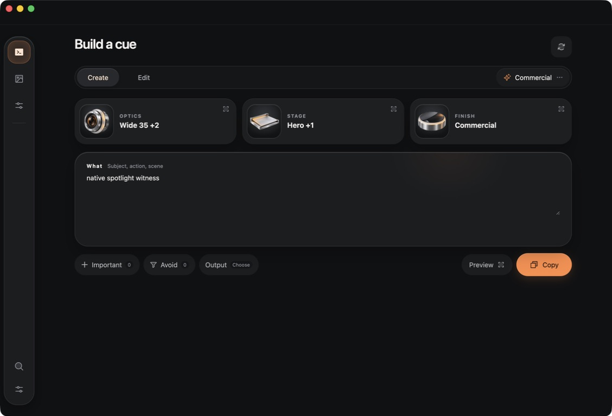
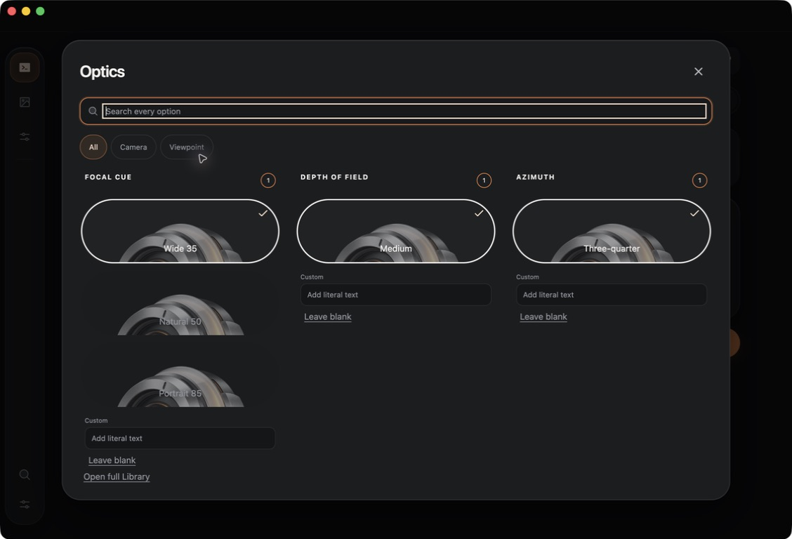

# Reaudit and mismatch log

Audit date: 2026-09-13. Baseline: current dirty workspace built with `npm run preview`; no application source changed by this planner. The five annotated screenshots describe an older UI. They supply requirements, not proof that every old defect persists today.

## Evidence and limits

| Evidence | Meaning |
|---|---|
| [Native main before](Evidence/01-native-main-before.jpg) | Built Electron main surface, 1128×768 screenshot pixels; selected Commercial preset with Optics, Stage, and Finish populated |
| [Native Optics before](Evidence/02-native-optics-before.jpg) | Same built app with scoped Optics picker open; images, labels, search focus, and selected outlines visible |
| Current renderer/source inspection | Cue, Library, Tokens, shell, styles, app wiring, shared UI types, and compiler read on this date; establishes implementation structure, not native motion quality |
| [Five annotated references](#annotation-index) | User's historical critique, retained unchanged and checked against current evidence |
| Existing execution handoffs | Prior native clipboard, shortcut, dismissal, and placement results; retained as prior evidence, not repeated or invalidated by this visual audit |

The Electron app was opened from the current workspace build at `teleprompter://app/index.html?surface=main`. The WHAT text and selected preset were already present. The two files above are JPEG captures; their extension matches their bytes. Their pixel dimensions do not establish native window bounds or CSS viewport dimensions.

Inspection stopped when CUA reported user activity and the subsequent selection state changed. No draft was restored or overwritten. Fresh Library, Tokens, Edit, compact spotlight, hover, keyboard-focus, reduced-motion, and animation results remain unwitnessed in this audit. The preview app was left open. No after images exist yet.

## The two decisive native mismatches

### Main composer

The current three controls are wide flat rounded rectangles with 72px square image wells, tiny upper-case group labels, and larger value text. An oversized WHAT card and a detached action row follow them. Compare the compact joined foundation and parameter row in the [parameter-composer reference](../References/03-Parameter-Composer.png). The new objects are present, but their integration has not achieved the requested anatomy.

### Optics picker

The large repeated lens crops through the bottom of each option and sits behind its label. The same object stands for Wide 35, Medium depth of field, and Three-quarter angle. Search has a rectangular inner white outline inside an orange outer focus border. Compare the fully contained objects above their labels and finite adjacent options in the [camera-selector reference](../References/02-Camera-Selector.png).

The current picker does have a short group title, appropriate group scoping, fewer empty cards, and visible selected outlines. Those improvements should survive the reset.

## Requirement-by-requirement findings

“Present” means the defect was observed natively or found in current source as stated. “Partial” means a concrete improvement exists but the requirement is not complete. “Unwitnessed” is not a failure claim. Acceptance IDs continue into the final [acceptance matrix](04-Acceptance.md).

### Cue and shell — annotation 01

| ID | Critique | Current finding | Required correction |
|---|---|---|---|
| R01 | Remove repeated brand/overlines/page headings | Partial: native shell has no brand lockup and “Compose locally” is gone; “Build a cue” remains | Open directly into controls; retain hidden semantic heading |
| R02 | Better Create/Edit control | Present natively: small segment is embedded in a page-wide bordered bar | Content-width segment and adjacent preset control |
| R03 | Group illustration scale and treatment | Present natively: nested square frame makes each object read as an appended app icon | One capsule boundary, contained large transparent object |
| R04 | Group/value hierarchy and raw IDs | Partial: main values are humanized and helper summaries removed; tiny uppercase group label remains subordinate to value | Group name leads; selected values move to inspection; no `Choose`/`+n` stack |
| R05 | Stray textarea handle and oversized field | Present natively and in `resize:vertical` source | Measured editor growth inside common foundation |
| R06 | Applied output defaults | Present natively: “Output Choose”; accepted seed exposes output axes but no accepted output atoms | Saved defaults only for new Create drafts, per Mission 0; preserve existing drafts |
| R07 | Inconsistent icon/text ordering and Copy treatment | Present natively: Preview label precedes icon; large labelled Copy | Consistent vector actions; single icon Copy, icon Preview |

### Library and detail — annotation 02

| ID | Critique | Current finding | Required correction |
|---|---|---|---|
| R08 | Remove Library headings, overlines, and counts | Partial in source: overline removed; h1, result status, and card direction/slot counts remain | Compact browse toolbar, no decorative counts |
| R09 | Make cards visually centred on the record | Partial in source: artwork-first card exists, but group art is reused as fallback; no fresh native comparison | Record cover geometry and honest missing-image treatment |
| R10 | Apply/Copy distinction and placement | Present in source: adjacent labelled Apply/Copy detail actions | “Use in Cue” in header; Copy beside exact prompt |
| R11 | Better preset deconstruction, less technical prose | Partial in source: readable labels added in some areas; detail still has “Exact direction breakdown,” a summary, and implementation-oriented explanatory structure | Grouped human direction specimens; keep IDs in source/shorthand inspection |
| R12 | Copy-block icon and custom disclosure chevron | Present in source: separate Copy action and native `details/summary` structure; native appearance unverified | Block-local icon Copy and Phosphor disclosure chevron with keyboard behavior |

### Tokens and settings — annotation 03

| ID | Critique | Current finding | Required correction |
|---|---|---|---|
| R13 | Replace conventional large-row dictionary | Partial in source: row labels improved, but structure remains stacked full-width token rows | Category index, term grid, one inspector |
| R14 | Remove heading/count clutter and filter-chip cloud | Present in source: Tokens h1, match count, category counts, field-chip list | Compact search and text category index; assistive result status |
| R15 | Avoid raw titles and implementation leaks | Partial in source: row titles humanized; detail uses raw `choice.label`, summaries as readable text, and asset availability prose | Human titles throughout; exact expansion from lead read seam; real example or concise empty state |
| R16 | Settings must perform a meaningful action | Present in app wiring: Settings emits the “intentionally compact…desktop bridge” message | Working shortcut dialog using existing bridge; specific errors only |

### Picker — annotation 04 and latest blank-field comment

| ID | Critique | Current finding | Required correction |
|---|---|---|---|
| R17 | Excess heading, empty nested cards, and chip navigation | Partial: scoped Optics and hidden empty axes witnessed; Camera/Viewpoint chips remain | Short header, underline tabs, populated axes plus one reachable custom field |
| R18 | Image-emphasized choices with less text | Present natively: full labels are short, but enormous clipped generic lens art dominates and overlaps | Contained art above label, semantic per-record mapping; no invented photo evidence |
| R19 | Ugly search focus | Present natively: two competing outlines | One wrapper focus ring |
| R20 | Remove “Choose one,” repeated Custom, and Leave blank | Partial: “Choose one” is not visible in captured view; source still renders it, repeats field editors per axis, and provides Leave blank buttons | Natural blank, one field editor, selected-only clear control |

### Preview — annotation 05

| ID | Critique | Current finding | Required correction |
|---|---|---|---|
| R21 | Remove acknowledgement/title/count/footer clutter and code-table feel | Partial in source: acknowledgement overline gone; title, placeholder count, labelled sections, and selectable-text footer remain | Readable exact compiler text, restrained format switch, one Copy icon |
| R22 | Expanded and Shorthand should differ meaningfully | Source-confirmed integration defect: `PreviewPanel` uses `choice.label` versus `choice.shorthand`, while the actual compiler uses `atom.expansion` versus shorthand; the preview also constructs Create-like field sections for either mode | Expose compiler result without copying; show exact Create/Edit result for matching acknowledged revision/format |

### Original direction still requiring proof

| ID | Area | Current evidence | Acceptance requirement |
|---|---|---|---|
| R23 | Tactile motion and connected expansion | Motion imports, springs, and fade/scale are in source. Trigger has a layout ID, but no paired expanding surface was found; no bounded magnetic controller found | Real native motion witness, stable hitbox, paired surface transition, reduced motion |
| R24 | Compact spotlight and zoom | Source uses a single-column group stack below 740px. Fresh native compact rendering was not captured | Adaptive bar and compact overview under 07; Copy remains reachable |
| R25 | Keyboard, selection, and native regression | Prior desktop results remain valid for their recorded scope; current pointer activity limited this audit | Targeted post-reset native smoke plus keyboard/focus cases; no inferred hardware or multi-display pass |

## Follow-up requirements — adaptive Cue and quick add

These are new requirements from the user's subsequent message, not conclusions drawn from the historical screenshots.

| ID | Requirement | Current finding | Planned resolution |
|---|---|---|---|
| R26 | Cue viewport fits its visible content | Source-confirmed two-size request contract; transparent panel already exists | Measured native layout with stable launch anchor and bounded height, per 07 |
| R27 | Translucent shapes, smooth opening, correct clicks/focus | Public API research completed; new combined native behavior untested | Electron host spike, with narrow native-material/NSPanel fallback if named tests fail |
| R28 | Compact, useful multi-option controls | Current giant clipped lens options witnessed; new compact pattern not implemented | One active axis; cardinality-based row/rail/list/ticker; strict height budget |
| R29 | `/` searches and adds snippets/presets | New feature; not present in audited Cue source | Local trigger/search controller and explicit result actions |
| R30 | Quick-add selection is atomic and undoable | Existing command envelope supplies revision protection, but no compound quick-add command | Reuse selection routines within one validated text/semantic mutation |
| R31 | `@` identifies an exact reference image | Existing draft has numbered role/note references, without inline mention or local image-binding UI | Stable numbered slots, literal Image N insertion, optional local thumbnails, no silent renumbering |

See [native research](05-Adaptive-Window-Research.md), [interaction research](06-Compact-Interaction-Research.md), [adaptive contract](07-Adaptive-Cue-Contract.md), and [quick-add contract](08-Quick-Add-and-References.md). Their native behavior remains open until the additional acceptance cases pass.

## Source pointers

| File | Relevant responsibility |
|---|---|
| [CueSurface.tsx](../../../src/renderer/src/ui/CueSurface.tsx) | ParameterTile, AxisSlot, OverlayLayer, PreviewPanel, outputSummary |
| [global.css](../../../src/renderer/src/styles/global.css) | Group image wells, slot thumbnail sizing, selected states, compact stacking |
| [LibrarySurface.tsx](../../../src/renderer/src/ui/LibrarySurface.tsx), [TokensSurface.tsx](../../../src/renderer/src/ui/TokensSurface.tsx) | Browser/detail structure, title projection, action placement |
| [TeleprompterApp.tsx](../../../src/renderer/src/app/TeleprompterApp.tsx), [ui-types.ts](../../../src/shared/ui-types.ts) | Settings feedback, bridge-backed copy, missing compiler-preview prop |
| [compile.ts](../../../src/engine/cue/compile.ts), [legacy-adapter.ts](../../../src/content/legacy-adapter.ts) | Existing correct expansion/shorthand behavior; final accepted-seed filtering |

## Annotation index

| Copy | Covers |
|---|---|
| [01 — Cue](References/01-Annotated-Cue.png) | Title, modes, group controls, WHAT, output, actions |
| [02 — Library](References/02-Annotated-Library.png) | Visual cards, detail hierarchy, Apply/Copy, deconstruction |
| [03 — Tokens](References/03-Annotated-Tokens.png) | Dictionary structure, filters, counts, settings message |
| [04 — Picker](References/04-Annotated-Picker.png) | Short header, search focus, image choices, natural blanks |
| [05 — Preview](References/05-Annotated-Preview.png) | Readable compiled text and distinct formats |

The next witness appends after evidence to a new execution folder, not to these before files. A resolved row needs both a specific implemented correction and evidence at the appropriate level.
